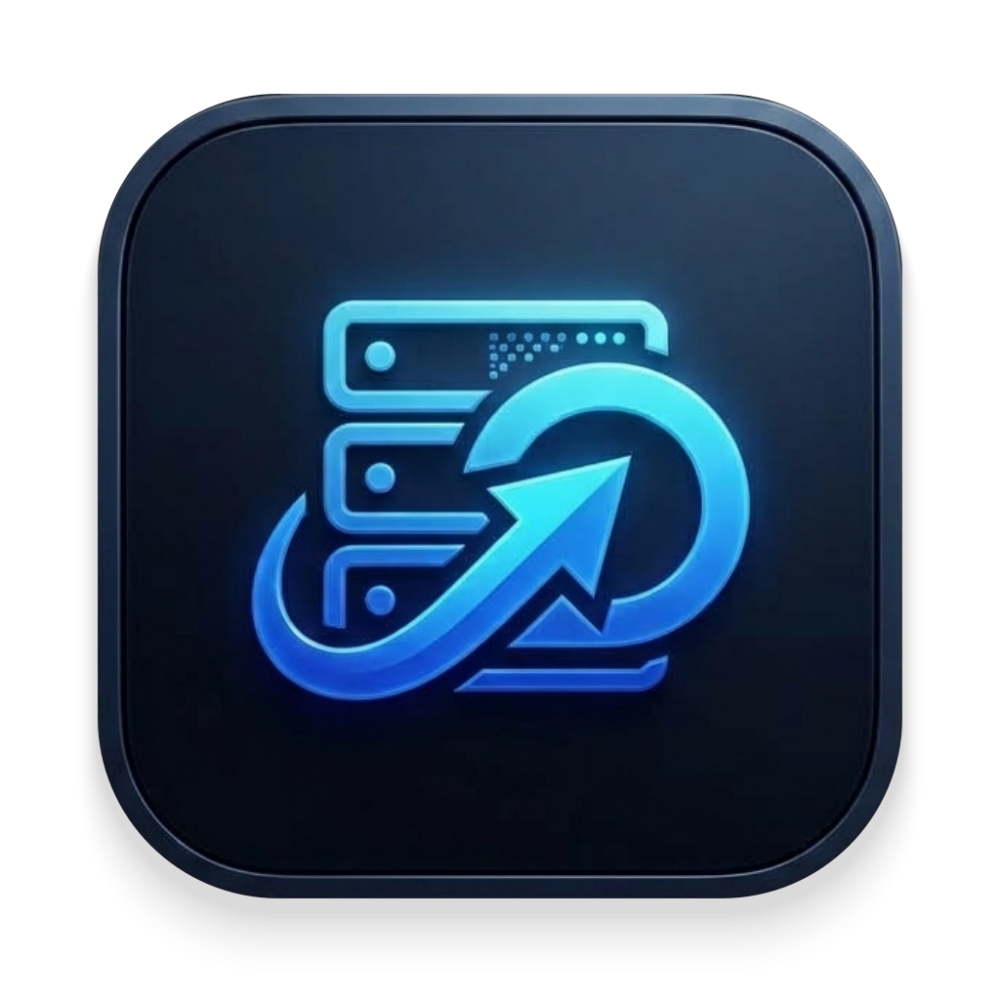

# NasMove

<p align="center">
  
  <br />
  <strong>面向 macOS 与 Synology NAS 的专业级高可靠数据迁移桌面应用</strong>
</p>

---

## 📖 项目简介

**NasMove** 是一款专为 macOS 设计的现代化网络存储迁移工具，专注于 Mac 本地与群晖 Synology NAS（SMB 协议）之间的大规模、高吞吐、可靠文件传输。

NasMove 的核心工程理念是 **“中断是常态，数据完整性是底线”**：
- **真正的移动语义**：严格遵循 `复制成功 → 完整 SHA-256 校验 → 远端原子提交 → 移入废纸篓/安全删除源文件`。目标未确认 100% 完整之前绝不触碰源文件；若删除源文件失败，自动保留源与目标并报备警告。
- **无惧断网与断电**：通过远端临时写入对象、4 MiB 流式分块、64 MiB 持久化校验检查点与指数退避重试机制，遭遇真实网络抖动或 NAS 服务端重启时，自动重连并仅从已确认安全偏移量断点续传。

---

## ✨ 核心特性

### 1. 🖥 现代化双栏迁移工作台 (Dual-Pane Workbench)
- **并排浏览**：左侧浏览本地 Mac 目录，右侧浏览远端 NAS 共享目录，目录路径层级直观可见；
- **文件夹置顶与精准数值排序**：支持按文件名、文件大小（按真实字节大小排序，避免字符排序陷阱）、修改时间排序，文件夹始终置顶（Folders First）；
- **平滑搜索与防抖过滤**：集成 250ms 防抖文件搜索，大目录下输入即时筛选，回车立即定位；
- **就地新建目录与刷新**：支持在本地及 NAS 远端直接创建新文件夹，并自动平滑刷新；
- **macOS Finder 拖拽支持**：支持直接从系统 Finder 拖拽文件或文件夹至工作台，即刻定位；
- **子目录目标精确定位**：右侧选中 NAS 任何子文件夹即可直接作为任务目标，无需繁琐进入或退回根目录。

### 2. ⚡️ 工业级断点续传与原子提交引擎 (Reliable Engine)
- **分块写入与多层检查点**：大文件按 4 MiB 块分块写入，每 64 MiB 生成经远端确认的 SQLite 持久化检查点；
- **多并发文件传输**：支持单任务内 1~4 个文件多路并发写入（`TransferItemWorker`），兼顾大文件吞吐与海量小文件并发性能；
- **端到端哈希校验**：传输完成后执行全量 SHA-256 校验，防止数据传输静默写脏；
- **原子重命名提交**：以临时文件名写入，校验通过后执行原子重命名生效，避免竞争或不完整文件被意外消费；
- **平滑速度曲线**：采用指数移动平均（EMA $\alpha=0.2$）算法计算实时传输速度与估算剩余时间（ETA），消除剧烈抖动。

### 3. 🎨 原生 macOS 视觉与无障碍体验 (Native macOS UX)
- **专属 macOS 原生图标**：精心打造黑曜石极客版（Obsidian Neon）应用图标，符合 Apple Human Interface Guidelines 规范，具备标准 Squircle（超椭圆）曲率、多层柔和环境悬浮阴影与 10 档 Retina 高清分辨率；
- **常驻导航侧边栏**：左侧主导航栏常驻可见，方便在「迁移工作台」、「任务队列」、「账号与连接」之间无缝切换；在任务详情页提供 `‹ 返回迁移工作台` 快捷链路；
- **全场景自适应主题**：
  - 支持 **跟随系统**、**雾蓝玻璃**、**深夜运维**、**暖灰工作室** 四种外观主题；
  - 状态标签、恢复警告横条均严格符合 **WCAG 4.5:1** 对比度无障碍标准；
- **精心打磨的控件质感**：
  - 次级与控制按钮常态具备细腻实体微边框与卡片底色，悬浮与下压具备触控反馈；
  - 下拉选择框集成 Apple 风格微距矢量折线箭头（Chevron `⌄`），预留 30px 舒适安全间距。

---

## 🔒 安全与数据保护边界

1. **凭据安全隔离**：连接密码仅保存在本机私有 SQLite 数据库的专用凭据表中，严格限制当前用户读写权限（`0700`），绝不写入任务快照、配置备份或调试日志。
2. **非破坏性移动**：任何源文件的删除操作均在目标原子提交成功后执行，优先移入系统废纸篓。
3. **冲突保护策略**：支持「保留两者（自动追加后缀）」、「覆盖目标」与「跳过已存在」三种策略，并附带详细预检语义说明。
4. **协作式优雅停机**：应用退出或窗口关闭时，底层线程协作式中断并安全持久化断点，下一次启动自动读取并提示恢复未完成任务。

---

## 🛠 快速上手与本地开发

### 环境要求
- macOS 11.0+ (Big Sur 及以上版本)
- Python 3.12

### 1. 安装与运行
推荐使用虚拟环境启动：

```bash
# 进入项目根目录并创建虚拟环境
python3.12 -m venv .venv
source .venv/bin/activate

# 安装可编辑依赖包
pip install -e '.[dev]'

# 直接启动应用（开发热更新模式）
python -m nasmove.ui.desktop_app
```

### 2. 自动化测试与质量保障
项目拥有完备的测试矩阵，覆盖 UI 交互、故障恢复与真实 NAS 协议交互：

```bash
# 运行全量 UI 交互单元测试 (155 项)
PYTHONPATH=. pytest tests/unit/ui

# 运行集成测试套件
PYTHONPATH=. pytest tests/integration

# 运行代码规范与类型检查
ruff check src tests
mypy src
```

---

## 📦 打包 macOS 独立应用 (.app)

本项目基于 `pyside6-deploy` 与 Nuitka 提供全量编译打包流水线，生成原生独立的 macOS App Bundle：

```bash
# 执行本地打包脚本（自动检测证书、生成图标与执行 Hardened Runtime 代码签名）
bash scripts/build_macos_app.sh
```

- **生成产物**：`dist/NasMove.app`
- **签名机制**：默认使用本地证书 `NasMove Local Signing`，满足 macOS Designated Requirement；如需公开分发，可配置 `NASMOVE_SIGNING_IDENTITY` 与 `NASMOVE_NOTARY_PROFILE` 完成苹果公证（Notarization）。
- **运行打包版**：
  ```bash
  open dist/NasMove.app
  ```

---

## 📚 文档索引

- [设计文档](docs/superpowers/specs/2026-09-05-nas-reliable-transfer-design.md)
- [实施计划](docs/superpowers/plans/2026-09-05-nas-reliable-transfer.md)
- [界面与交互重构方案](docs/superpowers/plans/2026-09-09-nasmove-ui-interaction-redesign.md)
- [多配置与多工作线程并发架构](docs/superpowers/specs/2026-09-11-nas-profile-item-concurrency-design.md)
- [Synology 测试验证矩阵](docs/verification/synology-test-matrix.md)
- [发布检验清单](docs/verification/release-checklist.md)
